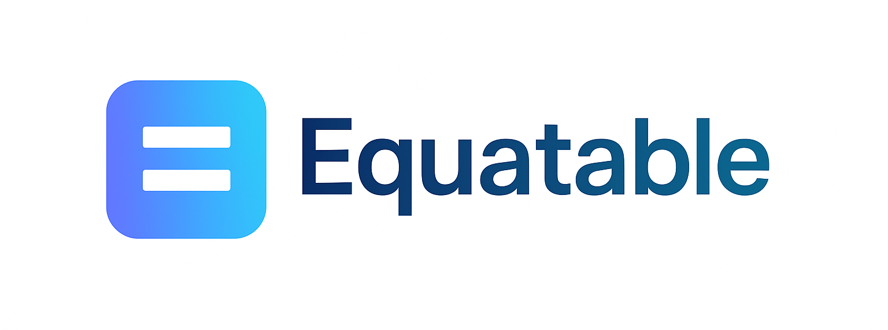

[<center></center>](https://www.nuget.org/packages/Equatable)

# Equatable

**Equatable** is a C# library designed to simplify and standardize value-based equality in your classes and structs. By leveraging this utility, you can avoid repetitive boilerplate code typically associated with overriding `Equals()` and `GetHashCode()`.

## Why Use Equatable?

Equatable becomes especially powerful when working with:

- **JSON (de)serialization**: Quickly compare deserialized objects for changes or synchronization.
- **Large collections of diverse data types**: Simplify equality checks across many instance types.
- **Immutable data structures**: Perfect for scenarios where equality must depend purely on value.

When handling a large number of instances or managing complex data models (common in APIs, distributed systems, or UI diffing logic), Equatable helps keep your code clean, consistent, and reliable.

## Features

- 🔁 Value-based equality without boilerplate
- 🧩 Easy integration with any class or struct
- 📦 Works seamlessly with collections and serialization scenarios
- 🧼 Improves readability and maintainability

## Getting Started

### Installation

You can easily install Equatable from NuGet:
```bash
dotnet add package Equatable --version 1.0.11
```
Or via the NuGet Package Manager in Visual Studio:

```bash
Install-Package Equatable
```

# Equatable Pattern in C# – Clean Value-Based Equality

This repository demonstrates how to implement **value-based equality** in C# using an abstract base class called `BaseEquatable`.

Instead of manually overriding `Equals`, `GetHashCode`, and `ToString` in every model, you can inherit from `BaseEquatable` and define which properties participate in equality through the `Props` list.

---

# ❌ Without BaseEquatable (Manual Implementation)
```csharp
class Person 
{
    public string? Name { get; set; }
    public int Age { get; set; }

    public override string ToString()
    {
        return $"{Name}, {Age}";
    }

    public override bool Equals(object? obj)
    {
        if (obj is Person other) 
        {
            return Name == other.Name && Age == other.Age;
        }
        return false;
    }

    public override int GetHashCode()
    {
        return HashCode.Combine(Name, Age);
    }
}
```

# Drawbacks
  - Verbose and repetitive.

  - Easy to forget updating one method when properties change.

  - Harder to scale across multiple classes.

### Key Update:
  > **Note**: If your class has many properties, the implementation of `Equals` and `GetHashCode` can become more cumbersome and prone to errors. Each additional property you add to the class requires manual updates to the `Equals` and `GetHashCode` methods, leading to bloated code.

---
## ✅ With `BaseEquatable` (Preferred)

```csharp
class Person : BaseEquatable
{
    public string? Name { get; set; }
    public int Age { get; set; }

    public override List<object?> Props => [Name, Age];

    public override bool? Stringify => true;
}
```
# Benefits
  - No need to override Equals, GetHashCode, or ToString manually.

  - Consistent and reliable structural equality.

  - Easier to maintain and extend.

  - Cleaner, DRY (Don't Repeat Yourself) code.

# Example of output
```csharp
var p1 = new Person { Name = "Rustam", Age = 30 };
var p2 = new Person { Name = "Rustam", Age = 30 };
var p3 = new Person { Name = "Iskandar", Age = 30 };

Console.WriteLine(p1.Equals(p2));  // True
Console.WriteLine(p1.Equals(p3));  // False
Console.WriteLine(p1.GetHashCode() == p2.GetHashCode()); // True
Console.WriteLine(p1); // Rustam, 30 (if Stringify == true)
```


## 📝 Contributing

If you find any issues, have suggestions, or ideas to improve this library, please feel free to open an issue in the [Issues section](https://github.com/iskandarem/Equatable/issues). Contributions and ideas are welcome!


